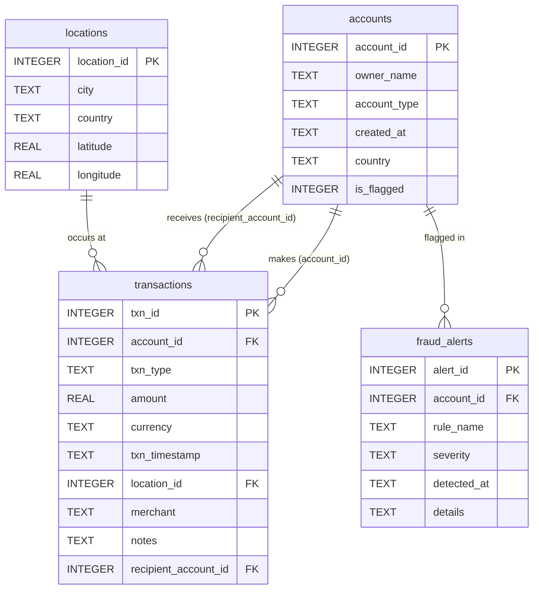

# 🗄️ SQL Fraud Detection Engine — Database ER Diagram

## Entity Relationship Diagram



---

## Table Descriptions

### 🟦 `accounts` — Bank Customers
| Column | Type | Notes |
|--------|------|-------|
| `account_id` | INTEGER | 🔑 Primary Key |
| `owner_name` | TEXT | Full name (Faker-generated) |
| `account_type` | TEXT | `checking` / `savings` / `business` |
| `created_at` | TEXT | ISO-8601 datetime |
| `country` | TEXT | Default `'US'` |
| `is_flagged` | INTEGER | `1` = known bad actor |

---

### 🟩 `locations` — City Coordinates (20 global cities)
| Column | Type | Notes |
|--------|------|-------|
| `location_id` | INTEGER | 🔑 Primary Key |
| `city` | TEXT | e.g. `"New York"`, `"Tokyo"` |
| `country` | TEXT | ISO country code |
| `latitude` | REAL | Used in Haversine formula |
| `longitude` | REAL | Used in Haversine formula |

---

### 🟧 `transactions` — Every Money Movement *(Central Table)*
| Column | Type | Notes |
|--------|------|-------|
| `txn_id` | INTEGER | 🔑 Primary Key (AUTOINCREMENT) |
| `account_id` | INTEGER | 🔗 FK → `accounts.account_id` |
| `txn_type` | TEXT | `debit` / `credit` / `transfer` |
| `amount` | REAL | Must be > 0 |
| `currency` | TEXT | Default `'USD'` |
| `txn_timestamp` | TEXT | ISO-8601 — used for LAG(), julianday() |
| `location_id` | INTEGER | 🔗 FK → `locations.location_id` |
| `merchant` | TEXT | For debit transactions |
| `notes` | TEXT | Fraud test labels |
| `recipient_account_id` | INTEGER | 🔗 FK → `accounts.account_id` (transfers only) |

---

### 🟥 `fraud_alerts` — Detection Output Table
| Column | Type | Notes |
|--------|------|-------|
| `alert_id` | INTEGER | 🔑 Primary Key (AUTOINCREMENT) |
| `account_id` | INTEGER | 🔗 FK → `accounts.account_id` |
| `rule_name` | TEXT | `RAPID_FIRE` / `UNUSUAL_AMOUNT` / `GEO_IMPOSSIBLE` / `SMURFING` / `LAUNDERING_CHAIN` |
| `severity` | TEXT | `LOW` / `MEDIUM` / `HIGH` / `CRITICAL` |
| `detected_at` | TEXT | Auto-set to `datetime('now')` |
| `details` | TEXT | Human-readable anomaly description |

---

### 🟣 `account_spending_stats` — Derived View
> Built from `transactions` — powers Phase 3 Z-score detection

| Column | Derived As |
|--------|-----------|
| `account_id` | GROUP BY key |
| `total_txns` | `COUNT(*)` |
| `avg_amount` | `AVG(amount)` |
| `variance_amount` | `AVG(amount²) - AVG(amount)²` |
| `min_amount` | `MIN(amount)` |
| `max_amount` | `MAX(amount)` |

---

## Relationships Summary

```
accounts  ──<  transactions   (1 account → many transactions)
accounts  ──<  transactions   (1 account → many received transfers)  [recipient_account_id]
locations ──<  transactions   (1 location → many transactions)
accounts  ──<  fraud_alerts   (1 account → many alerts)
```

---

## Indexes (Phase 7)

| Index | Columns | Purpose |
|-------|---------|---------|
| `idx_txn_account_ts` | `(account_id, txn_timestamp)` | Rapid-fire & geo window queries |
| `idx_txn_type` | `(txn_type)` | Filter debit/transfer fast |
| `idx_txn_recipient` | `(recipient_account_id)` | Smurfing & laundering joins |
| `idx_txn_location` | `(location_id)` | Geo-impossible location joins |
| `idx_accounts_name` | `(owner_name)` | Dashboard name lookups |
| `idx_locations_city` | `(city)` | City-based geo lookups |


